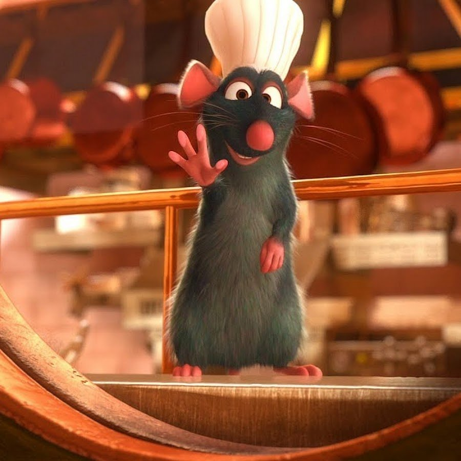

# Achievement System

достижения за выполнение определенных заданий. Некоторые достижения дают бонусы в виде токенов SGR и ONA, другие дают льготы и дополнительные возможности внутри приложения.

In-Game Achievement is tied to each user's account. It is not on the Bloc

ниже представлены примеры достижений:

<table data-view="cards"><thead><tr><th></th><th></th><th></th></tr></thead><tbody><tr><td>Писака  15 дней подряд заполнял дневник на 100%.  +25 HRMT</td><td></td><td></td></tr><tr><td></td><td></td><td>Ходок  5 дней подряд ходил 10000 шагов и более  +50 HRMT</td></tr><tr><td>Гурман  Выполнял норму калорий, витаминов и минералов и не переедал 14 дней подряд  +40 HRMT, открыты новые полезные рецепты</td><td></td><td></td></tr><tr><td>Усейн Болт</td><td> Попал в топ 1000 лидерборда в режиме "марафон"  +500 HRPT</td><td></td></tr><tr><td>Рататуй</td><td>Добавил 5 рецептов или 5 продуктов</td><td>+150 HRPT </td></tr><tr><td>Сонный</td><td>7+ дней подряд держал свой сон в рамках нормы +100 HRPT </td><td></td></tr></tbody></table>
